# DNA Pattern Matcher

A bioinformatics tool for finding patterns in DNA sequences using finite automata theory.

---

## Overview

DNA Pattern Matcher

- **Find exact patterns** (restriction sites, codons, motifs)
- **Use regex patterns** for flexible matching (`ATG[ACGT]*TAA`)
- **Allow mismatches** for approximate matching using Levenshtein automata
- **Visualize the automaton** used for matching

### How It Works

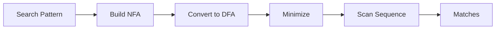

1. Your search pattern is converted to a Non-deterministic Finite Automaton (NFA)
2. The NFA is converted to a Deterministic Finite Automaton (DFA)
3. The DFA is minimized for efficiency
4. The sequence is scanned in linear time O(n)

---

## Table of Contents

1. [Features](#features)
2. [Technical Reference](#technical-reference)
   - [Automata Theory Fundamentals](#automata-theory-fundamentals)
   - [Thompson's Construction Algorithm](#thompsons-construction-algorithm)
   - [Subset Construction (NFA to DFA)](#subset-construction-nfa-to-dfa)
   - [Hopcroft's Minimization Algorithm](#hopcrofts-minimization-algorithm)
   - [Pushdown Automata (PDA) Stack Operations](#pushdown-automata-pda-stack-operations)
   - [CFG to PDA Conversion](#cfg-to-pda-conversion)
3. [Command Line Interface](#command-line-interface-cli)
4. [API Reference](#api-reference)

---

## Features

### Pattern Types

| Type | Description | Example |
|------|-------------|---------|
| **Exact Match** | Find exact occurrences | `ATG`, `GAATTC` |
| **Regex Pattern** | Wildcards and alternation | `ATG[ACGT]*TAA`, `TAA\|TAG\|TGA` |
| **Restriction Sites** | Common enzyme cut sites | EcoRI, BamHI, HindIII |
| **Common Motifs** | Biological motifs | Start codon, TATA box |

### Fuzzy Matching

Allow 0-3 mismatches to find similar sequences. Uses a Levenshtein automaton that extends the DFA to track edit distance.

### Sequence Analysis

- **GC Content**: Percentage of G and C bases
- **Base Composition**: A:T:G:C ratio
- **Complement**: 3' → 5' complement strand
- **Reverse Complement**: 5' → 3' of complement

---

# Technical Reference

This section provides mathematically rigorous documentation of the algorithms implemented in this project.

## Chomsky Hierarchy and Language Classes

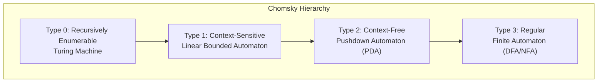

This project implements:
- **DFA/NFA** for regular language pattern matching (DNA motifs, regex)
- **PDA** for context-free language recognition (balanced structures, RNA stem-loops)

---

## Automata Theory Fundamentals

### Formal Definitions

#### Non-deterministic Finite Automaton (NFA)

An NFA is a 5-tuple **M = (Q, Σ, δ, q₀, F)** where:

| Symbol | Definition | Implementation |
|--------|------------|----------------|
| **Q** | Finite set of states | `std::map<StateId, State> states_` |
| **Σ** | Input alphabet | `std::set<Symbol>` extracted from transitions |
| **δ** | Transition function: Q × (Σ ∪ {ε}) → P(Q) | `std::vector<Transition> transitions_` |
| **q₀** | Start state | `StateId startState_` |
| **F** | Set of accepting states | `std::set<StateId> acceptingStates_` |

> [!NOTE]
> NFAs allow ε-transitions (empty string transitions) and multiple transitions from a state on the same symbol.

#### Deterministic Finite Automaton (DFA)

A DFA is a 5-tuple **M = (Q, Σ, δ, q₀, F)** where:

| Symbol | Definition | Implementation |
|--------|------------|----------------|
| **Q** | Finite set of states | `std::map<StateId, State> states_` |
| **Σ** | Input alphabet | `std::set<Symbol> alphabet_` |
| **δ** | Transition function: Q × Σ → Q | `std::map<std::pair<StateId, Symbol>, StateId> transitionTable_` |
| **q₀** | Start state | `StateId startState_` |
| **F** | Set of accepting states | `std::set<StateId> acceptingStates_` |

> [!IMPORTANT]
> DFAs have exactly one transition per symbol from each state, enabling O(n) string matching.

#### Pushdown Automaton (PDA)

A PDA is a 7-tuple **M = (Q, Σ, Γ, δ, q₀, Z₀, F)** where:

| Symbol | Definition | Implementation |
|--------|------------|----------------|
| **Q** | Finite set of states | `std::map<StateId, State> states_` |
| **Σ** | Input alphabet | Implicit from transitions |
| **Γ** | Stack alphabet | `StackSymbol` (char type) |
| **δ** | Transition function: Q × (Σ ∪ {ε}) × (Γ ∪ {ε}) → P(Q × Γ*) | `std::vector<PDATransition> transitions_` |
| **q₀** | Start state | `StateId startState_` |
| **Z₀** | Initial stack symbol | `StackSymbol initialStackSymbol_` (default: 'Z') |
| **F** | Set of accepting states | `std::set<StateId> acceptingStates_` |

---

## Thompson's Construction Algorithm

Thompson's construction converts a regular expression into an equivalent NFA. The algorithm works recursively on the structure of the regex.

### Implementation Location
- **File**: [regex_parser.cpp](file:///home/xo/Downloads/automata/automata-main/src/regex_parser.cpp)
- **Function**: `RegexParser::buildNFA()` (lines 303-407)
- **NFA primitives**: [nfa.cpp](file:///home/xo/Downloads/automata/automata-main/src/nfa.cpp) (lines 285-466)

### Algorithm Overview

```mermaid
flowchart TB
    subgraph "Thompson's Construction"
        RE[Regular Expression] --> Parse[Recursive Descent Parser]
        Parse --> AST[Abstract Syntax Tree]
        AST --> Build[Build NFA Recursively]
        Build --> NFA[Complete NFA]
    end
    
    subgraph "AST Node Types"
        CHAR[CHAR: Single symbol]
        UNION[UNION: a|b]
        CONCAT[CONCAT: ab]
        STAR[STAR: a*]
        PLUS[PLUS: a+]
        OPT[OPTIONAL: a?]
    end
```

### Base Cases

#### 1. Empty String (ε)


**Code** (`NFA::createEmpty()`):
```cpp
NFA nfa;
StateId start = nfa.addState("", false);
StateId end = nfa.addState("", true);
nfa.setStartState(start);
nfa.addEpsilonTransition(start, end);
return nfa;
```

#### 2. Single Symbol (a)

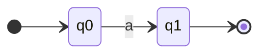

**Code** (`NFA::createSingle(Symbol s)`):
```cpp
NFA nfa;
StateId start = nfa.addState("", false);
StateId end = nfa.addState("", true);
nfa.setStartState(start);
nfa.addTransition(start, end, s);
return nfa;
```

### Inductive Cases

#### 3. Union (a | b)

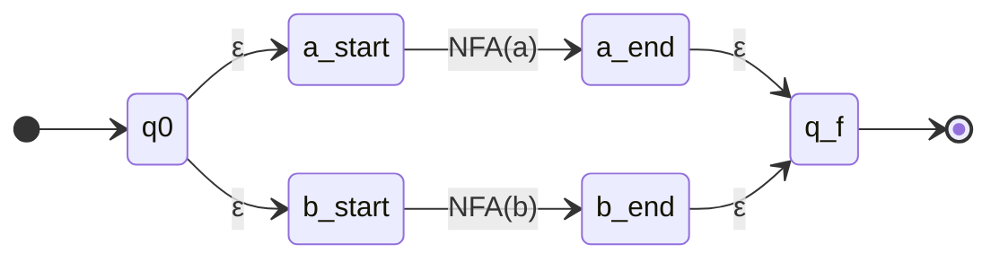

**Formal Construction**:
Given NFAs **M₁** for *a* and **M₂** for *b*:
1. Create new start state q₀
2. Create new accepting state qf
3. Add ε-transitions: q₀ → start(M₁), q₀ → start(M₂)
4. Add ε-transitions: accept(M₁) → qf, accept(M₂) → qf

#### 4. Concatenation (ab)

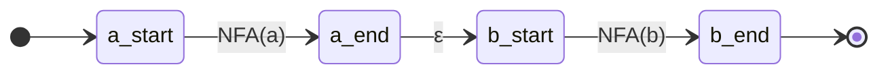

**Formal Construction**:
Given NFAs **M₁** for *a* and **M₂** for *b*:
1. Connect all accepting states of M₁ to start(M₂) via ε-transitions
2. New accepting states are exactly accept(M₂)

#### 5. Kleene Star (a*)

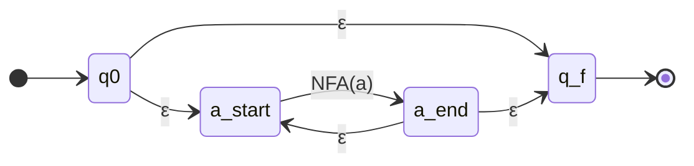

**Formal Construction**:
Given NFA **M** for *a*:
1. Create new start state q₀ and accepting state qf
2. Add ε-transition: q₀ → start(M) (enter)
3. Add ε-transition: q₀ → qf (skip - accept empty)
4. Add ε-transition: accept(M) → start(M) (loop back)
5. Add ε-transition: accept(M) → qf (exit)

### Complexity Analysis

| Regex Size | NFA States | NFA Transitions |
|------------|------------|-----------------|
| n symbols | O(2n) | O(4n) |

Thompson's construction produces an NFA with at most **2n states** and **4n transitions** for a regex of length n.

---

## Subset Construction (NFA to DFA)

The subset construction (also called powerset construction) converts an NFA to an equivalent DFA.

### Implementation Location
- **File**: [dfa.cpp](file:///home/xo/Downloads/automata/automata-main/src/dfa.cpp)
- **Function**: `DFA::fromNFA()` (lines 114-142)

### Algorithm Overview

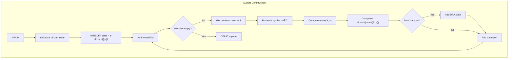

### Core Operations

#### ε-Closure

The ε-closure of a state set S is the set of all states reachable from S using only ε-transitions.

**Mathematical Definition**:
```
ε-closure(S) = S ∪ {q | ∃p ∈ S, p →ε* q}
```

**Implementation** (`NFA::epsilonClosure()`, lines 118-147):
```cpp
std::set<StateId> epsilonClosure(StateId state) const {
    std::set<StateId> closure;
    std::stack<StateId> stack;
    
    stack.push(state);
    closure.insert(state);
    
    while (!stack.empty()) {
        StateId current = stack.top();
        stack.pop();
        
        for (const auto& t : getTransitionsFrom(current, EPSILON)) {
            if (closure.find(t.getTo()) == closure.end()) {
                closure.insert(t.getTo());
                stack.push(t.getTo());
            }
        }
    }
    return closure;
}
```

#### Move Function

The move function computes transitions on a symbol.

**Mathematical Definition**:
```
move(S, a) = {q | ∃p ∈ S, (p, a, q) ∈ δ}
```

**Implementation** (`NFA::move()`, lines 149-157):
```cpp
std::set<StateId> move(const std::set<StateId>& states, Symbol symbol) const {
    std::set<StateId> result;
    for (StateId s : states) {
        for (const auto& t : getTransitionsFrom(s, symbol)) {
            result.insert(t.getTo());
        }
    }
    return result;
}
```

### Subset Construction Table Example

For pattern `a|b`:

| DFA State | NFA States | On 'a' | On 'b' |
|-----------|------------|--------|--------|
| D₀ | {0, 1, 3} | D₁ | D₂ |
| D₁ | {2, 5} (accept) | ∅ | ∅ |
| D₂ | {4, 5} (accept) | ∅ | ∅ |

### Complexity Analysis

| NFA States | Worst-case DFA States |
|------------|----------------------|
| n | O(2ⁿ) |

> [!WARNING]
> The subset construction can cause exponential blowup in the worst case. However, for most practical patterns, the DFA size is manageable.

---

## Hopcroft's Minimization Algorithm

Hopcroft's algorithm minimizes a DFA by merging equivalent states.

### Implementation Location
- **File**: [dfa.cpp](file:///home/xo/Downloads/automata/automata-main/src/dfa.cpp)
- **Function**: `DFA::minimize()` (lines 144-192)

### Algorithm Overview

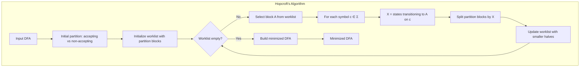

### Partition Refinement

The algorithm maintains a partition P of states and refines it:

1. **Initial Partition**: P = {F, Q - F} (accepting and non-accepting states)

2. **Refinement Step**: For each block A in worklist and symbol c:
   - Compute X = {q ∈ Q | δ(q, c) ∈ A}
   - For each block Y in partition:
     - If Y ∩ X ≠ ∅ and Y - X ≠ ∅, split Y into (Y ∩ X) and (Y - X)

3. **Termination**: When no more splits are possible

### Implementation Details

```cpp
DFA DFA::minimize() const {
    // Initial partition: accepting vs non-accepting
    std::set<StateId> accepting, nonAccepting;
    for (const auto& [id, state] : states_) {
        if (state.isAccepting()) accepting.insert(id);
        else nonAccepting.insert(id);
    }
    
    std::vector<std::set<StateId>> partition;
    if (!accepting.empty()) partition.push_back(accepting);
    if (!nonAccepting.empty()) partition.push_back(nonAccepting);
    
    std::vector<std::set<StateId>> workList = partition;
    
    while (!workList.empty()) {
        std::set<StateId> A = workList.back();
        workList.pop_back();
        
        for (Symbol c : alphabet_) {
            // X = states that transition to A on c
            std::set<StateId> X;
            for (const auto& [id, state] : states_) {
                auto next = getNextState(id, c);
                if (next && A.count(*next)) X.insert(id);
            }
            
            // Split each partition block by X
            // ... (refinement logic)
        }
    }
    
    // Build minimized DFA from partition
    // ...
}
```

### Complexity Analysis

| DFA States | DFA Transitions | Time Complexity |
|------------|-----------------|-----------------|
| n | m | O(n log n) |

Hopcroft's algorithm is optimal for DFA minimization.

---

## Pushdown Automata (PDA) Stack Operations

The PDA implementation uses a stack for recognizing context-free languages.

### Implementation Location
- **File**: [pda.cpp](file:///home/xo/Downloads/automata/automata-main/src/pda.cpp)
- **Header**: [pda.hpp](file:///home/xo/Downloads/automata/automata-main/include/automata/pda.hpp)

### Stack Representation

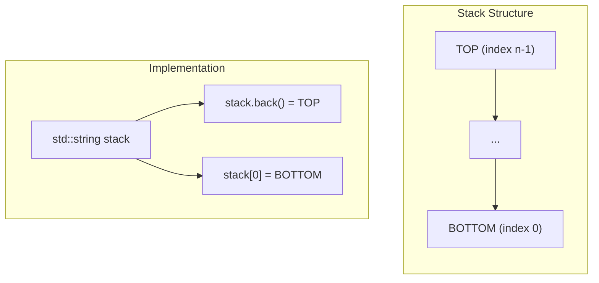

**Key Design Decisions**:
- Stack is represented as `std::string` for efficient operations
- **Bottom** of stack is at index 0
- **Top** of stack is at `stack.back()` (last character)
- Initial stack symbol: `'Z'` (configurable via `setInitialStackSymbol()`)

### Configuration Tuple

A PDA configuration is a snapshot of the machine state:

```cpp
struct Configuration {
    StateId state;           // Current state
    std::string remainingInput;  // Unread input
    std::string stack;       // Stack contents (bottom at [0], top at end)
};
```

**Mathematical Notation**: (q, w, γ) where:
- q = current state
- w = remaining input string
- γ = stack contents (top on right)

### Stack Operations

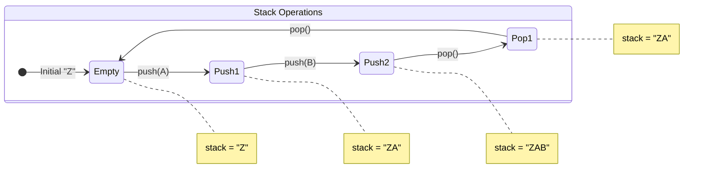

#### Push Operation

**Code** (pda.cpp, line 58):
```cpp
newConfig.stack += t.getPushSymbols();  // Append to end (push)
```

**Semantics**: Push symbols are appended to the string. Multiple symbols can be pushed at once; they appear in order (first character pushed first, ends up deeper on stack).

#### Pop Operation

**Code** (pda.cpp, lines 49-51, 57):
```cpp
// Check if we can pop
bool popStack = t.getPopSymbol() != EPSILON;
if (popStack && (config.stack.empty() || 
    config.stack.back() != t.getPopSymbol())) continue;

// Perform pop
newConfig.stack = popStack ? config.stack.substr(0, config.stack.size() - 1) 
                          : config.stack;
```

**Semantics**: Pop removes the last character of the string (top of stack).

### Transition Function

A PDA transition is defined as:
```
δ(q, a, X) → (p, γ)
```

Where:
- q = current state
- a = input symbol (or ε)
- X = stack symbol to pop (or ε)
- p = next state
- γ = symbols to push

**Implementation** (`PDATransition` class):
```cpp
class PDATransition {
    StateId from_;        // q
    StateId to_;          // p
    Symbol inputSymbol_;  // a (EPSILON for no input)
    StackSymbol popSymbol_;    // X (EPSILON for no pop)
    std::string pushSymbols_;  // γ
};
```

### Step Function

The `step()` function computes all possible next configurations:

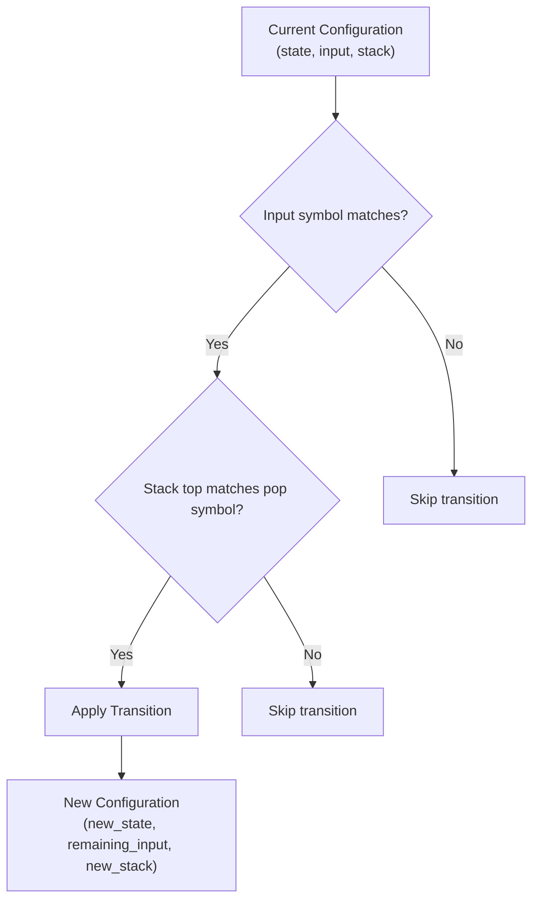

**Implementation** (pda.cpp, lines 38-63):
```cpp
std::vector<Configuration> PDA::step(const Configuration& config) const {
    std::vector<Configuration> next;
    
    for (const auto& t : transitions_) {
        if (t.getFrom() != config.state) continue;
        
        // Check input symbol
        bool consumeInput = t.getInputSymbol() != EPSILON;
        if (consumeInput && (config.remainingInput.empty() || 
            config.remainingInput[0] != t.getInputSymbol())) continue;
        
        // Check stack top
        bool popStack = t.getPopSymbol() != EPSILON;
        if (popStack && (config.stack.empty() || 
            config.stack.back() != t.getPopSymbol())) continue;
        
        // Create new configuration
        Configuration newConfig;
        newConfig.state = t.getTo();
        newConfig.remainingInput = consumeInput 
            ? config.remainingInput.substr(1) 
            : config.remainingInput;
        newConfig.stack = popStack 
            ? config.stack.substr(0, config.stack.size() - 1) 
            : config.stack;
        newConfig.stack += t.getPushSymbols();
        
        next.push_back(newConfig);
    }
    return next;
}
```

### Acceptance Modes

The PDA supports two acceptance modes:

#### 1. Acceptance by Final State

```cpp
bool PDA::acceptsByFinalState(const std::string& input) const {
    // Accept if: input consumed AND current state is accepting
    if (current.remainingInput.empty() && 
        acceptingStates_.count(current.state)) {
        return true;
    }
}
```

#### 2. Acceptance by Empty Stack

```cpp
bool PDA::acceptsByEmptyStack(const std::string& input) const {
    // Accept if: input consumed AND stack is empty
    if (current.remainingInput.empty() && current.stack.empty()) {
        return true;
    }
}
```

### Execution Trace Example

For balanced parentheses `(())`:

```
Step 0: (q0, "(())", "Z")
        → δ(q0, '(', ε) = (q0, "(")
Step 1: (q0, "())", "Z(")
        → δ(q0, '(', ε) = (q0, "(")
Step 2: (q0, "))", "Z((")
        → δ(q0, ')', '(') = (q0, ε)
Step 3: (q0, ")", "Z(")
        → δ(q0, ')', '(') = (q0, ε)
Step 4: (q0, "", "Z")
        → Input consumed, accepting state → ACCEPT
```

---

## CFG to PDA Conversion

The project implements the standard CFG-to-PDA construction for recognizing context-free languages.

### Implementation Location
- **File**: [pda.cpp](file:///home/xo/Downloads/automata/automata-main/src/pda.cpp)
- **Function**: `CFG::toPDA()` (lines 342-370)

### Context-Free Grammar (CFG) Definition

A CFG is a 4-tuple **G = (V, Σ, P, S)** where:

| Symbol | Definition | Implementation |
|--------|------------|----------------|
| **V** | Finite set of non-terminals | `std::set<char> nonTerminals_` |
| **Σ** | Finite set of terminals | `std::set<char> terminals_` |
| **P** | Production rules: V → (V ∪ Σ)* | `std::vector<Production> productions_` |
| **S** | Start symbol | `char startSymbol_` |

### Conversion Algorithm

The algorithm constructs a PDA that simulates leftmost derivations of the CFG.

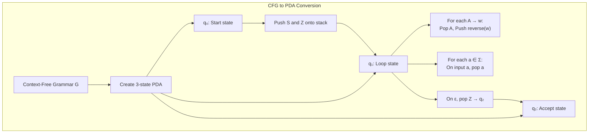

### Formal Construction

Given CFG **G = (V, Σ, P, S)**, construct PDA **M = (Q, Σ, Γ, δ, q₀, Z, F)** where:

- **Q** = {q₀, q₁, q₂}
- **Σ** = terminals from G
- **Γ** = V ∪ Σ ∪ {Z}
- **q₀** = start state
- **Z** = initial stack symbol
- **F** = {q₂}

**Transition Function δ**:

1. **Initialize**: δ(q₀, ε, Z) = {(q₁, SZ)}
   - Push start symbol onto stack

2. **Productions**: For each production A → w:
   - δ(q₁, ε, A) = {(q₁, reverse(w))}
   - Pop non-terminal, push production (reversed for correct order)

3. **Terminals**: For each terminal a ∈ Σ:
   - δ(q₁, a, a) = {(q₁, ε)}
   - Match input with stack top

4. **Accept**: δ(q₁, ε, Z) = {(q₂, ε)}
   - Accept when stack has only bottom marker

### Implementation

```cpp
PDA CFG::toPDA() const {
    PDA pda;
    StateId q0 = pda.addState("start", false);
    StateId q1 = pda.addState("loop", false);
    StateId q2 = pda.addState("accept", true);
    
    pda.setStartState(q0);
    pda.setInitialStackSymbol('Z');
    
    // 1. Push start symbol: δ(q₀, ε, Z) → (q₁, SZ)
    pda.addTransition(q0, q1, EPSILON, 'Z', 
                      std::string(1, startSymbol_) + "Z");
    
    // 2. For each production A → w: δ(q₁, ε, A) → (q₁, reverse(w))
    for (const auto& prod : productions_) {
        std::string reversed(prod.rhs.rbegin(), prod.rhs.rend());
        pda.addTransition(q1, q1, EPSILON, prod.lhs, reversed);
    }
    
    // 3. For each terminal a: δ(q₁, a, a) → (q₁, ε)
    for (char t : terminals_) {
        pda.addTransition(q1, q1, t, t, "");
    }
    
    // 4. Accept: δ(q₁, ε, Z) → (q₂, ε)
    pda.addTransition(q1, q2, EPSILON, 'Z', "");
    
    return pda;
}
```

### Why Reverse Production RHS?

When we pop non-terminal A and push the production's right-hand side, we need the leftmost symbol to be on top of the stack (for leftmost derivation simulation).

**Example**: For production S → aAB

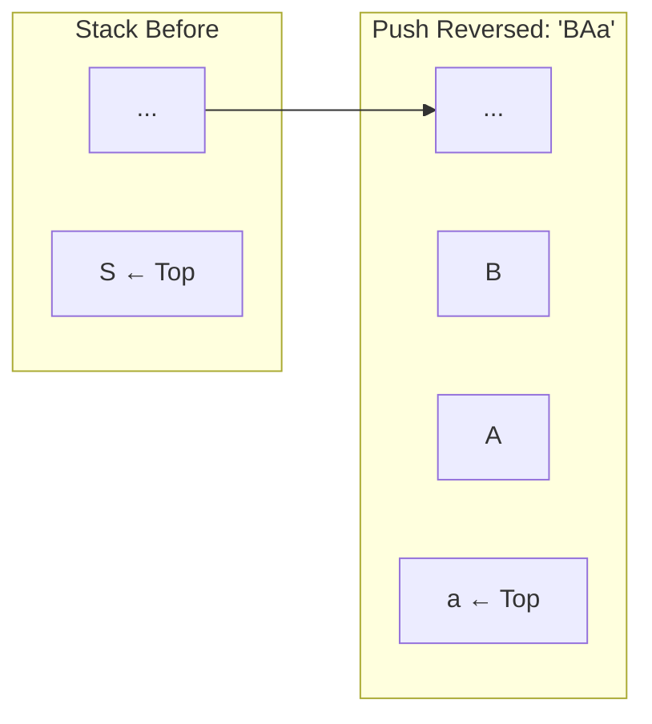

The reversed string "BAa" when pushed results in 'a' on top, ready to match the next input.

### Worked Example

**Grammar**:
```
S → aSb | ε
```
(Generates language {aⁿbⁿ | n ≥ 0})

**Converted PDA Transitions**:

| From | Input | Pop | Push | To | Rule |
|------|-------|-----|------|-----|------|
| q₀ | ε | Z | SZ | q₁ | Initialize |
| q₁ | ε | S | bSa | q₁ | S → aSb (reversed) |
| q₁ | ε | S | ε | q₁ | S → ε |
| q₁ | a | a | ε | q₁ | Match terminal |
| q₁ | b | b | ε | q₁ | Match terminal |
| q₁ | ε | Z | ε | q₂ | Accept |

**Trace for input "aabb"**:

```
(q₀, "aabb", "Z")
→ (q₁, "aabb", "SZ")        # Initialize: push S
→ (q₁, "aabb", "bSaZ")      # S → aSb: pop S, push bSa
→ (q₁, "abb", "bSZ")        # Match 'a': pop a
→ (q₁, "abb", "bbSaZ")      # S → aSb: pop S, push bSa
→ (q₁, "bb", "bbSZ")        # Match 'a': pop a
→ (q₁, "bb", "bbZ")         # S → ε: pop S
→ (q₁, "b", "bZ")           # Match 'b': pop b
→ (q₁, "", "Z")             # Match 'b': pop b
→ (q₂, "", "")              # Accept: pop Z
```

### Diagram: Complete PDA for aⁿbⁿ

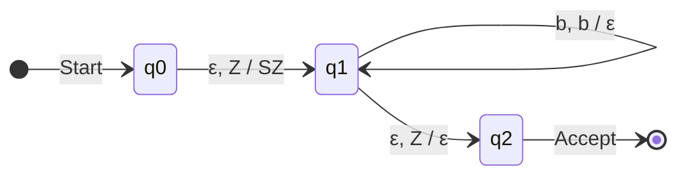

---

## Pre-built PDA Types

The implementation includes several pre-built PDAs:

### 1. Balanced Parentheses

**Language**: L = {(ⁿ)ⁿ | n ≥ 0}

```cpp
PDA PDA::createBalancedParentheses() {
    PDA pda;
    StateId q0 = pda.addState("q0", true);
    pda.setInitialStackSymbol('Z');
    
    // Push '(' on stack when seeing '('
    pda.addTransition(q0, q0, '(', EPSILON, "(");
    
    // Pop '(' when seeing ')'
    pda.addTransition(q0, q0, ')', '(', "");
    
    return pda;
}
```

### 2. aⁿbⁿ Language

**Language**: L = {aⁿbⁿ | n ≥ 0}

### 3. Palindrome Recognizer

**Language**: L = {ww^R | w ∈ {a,b}*}

Uses non-deterministic guess for the middle point.

### 4. RNA Stem-Loop Recognizer

Recognizes RNA secondary structures with base-pair complementarity:
- A pairs with U
- G pairs with C

---

## Command Line Interface (CLI)

The **`automata_cli`** binary provides a powerful command-line interface for working directly with automata, regular expressions, DNA pattern matching, and pushdown automata.

### Building the CLI

```bash
cd build
cmake ..
make
```

This produces the `build/automata_cli` executable.

### Commands Overview

| Command | Description |
|---------|-------------|
| `regex` | Parse regex, build NFA→DFA→minimized DFA, test strings |
| `dna`   | Find DNA patterns with approximate matching support |
| `pda`   | Test pushdown automata for context-free languages |
| `viz`   | Visualize NFA structure in ASCII art |

---

### `regex` - Regular Expression Demo

Build and test finite automata from regular expressions.

**Usage:**
```bash
automata_cli regex <pattern> [test_string]
```

**Example:**
```bash
./build/automata_cli regex "ab*" "abbb"
```

**Output:**
```
=== Regular Expression Demo ===

Pattern: ab*

1. NFA constructed via Thompson's algorithm:
   States: 6
   Transitions: 7

2. DFA constructed via subset construction:
   States: 3
   Transitions: 3

3. Minimized DFA:
   States: 2
   Transitions: 2

4. Regular Grammar:
   S -> aA
   A -> bA
   A -> ε

5. Testing "abbb": ACCEPTED ✓
```

---

### `pda` - Pushdown Automaton Demo

Test pushdown automata for various context-free language recognition tasks.

**Usage:**
```bash
automata_cli pda <type> <input>
```

**PDA Types:**

| Type | Language | Description |
|------|----------|-------------|
| `balanced` | `()^n` | Balanced/nested parentheses |
| `anbn` | `a^n b^n` | Equal a's followed by b's |
| `palindrome` | Palindromes over {a,b} | Palindrome recognizer |
| `rna` | RNA stem-loop | RNA secondary structure |

**Example:**
```bash
./build/automata_cli pda balanced "(())"
```

---

## API Reference

### POST /api/bio/match

Find patterns in a DNA sequence.

**Request:**
```json
{
  "sequence": "ATGCGATCGATCG",
  "pattern": "ATG",
  "maxDistance": 1,
  "searchBothStrands": true
}
```

**Response:**
```json
{
  "success": true,
  "matches": [
    {"start": 0, "end": 3, "text": "ATG", "distance": 0, "strand": "forward"}
  ],
  "dfaStates": 4,
  "matchType": "DFA"
}
```

---

## File Structure

```
Automata/
├── build/
│   └── automata_cli         # Command-line interface binary
├── include/
│   ├── automata/
│   │   ├── common.hpp       # Type definitions, constants
│   │   ├── nfa.hpp          # NFA class declaration
│   │   ├── dfa.hpp          # DFA class declaration
│   │   ├── pda.hpp          # PDA and CFG class declarations
│   │   ├── regex_parser.hpp # Regex parser declaration
│   │   ├── transition.hpp   # Transition classes
│   │   └── state.hpp        # State class
│   └── bio/                 # Bioinformatics utilities
├── src/
│   ├── nfa.cpp              # NFA implementation (Thompson's construction)
│   ├── dfa.cpp              # DFA implementation (subset, minimize)
│   ├── pda.cpp              # PDA implementation (CFG conversion)
│   ├── regex_parser.cpp     # Recursive descent regex parser
│   └── main.cpp             # CLI entry point
└── docs/
    └── DOCUMENTATION.md     # This file
```

---

## References

1. Hopcroft, J.E. et al. *Introduction to Automata Theory, Languages, and Computation*
2. Navarro, G. *A Guided Tour to Approximate String Matching*
3. Durbin, R. et al. *Biological Sequence Analysis*
4. Thompson, K. *Regular Expression Search Algorithm* (1968)
5. Hopcroft, J. *An n log n algorithm for minimizing states in a finite automaton* (1971)
