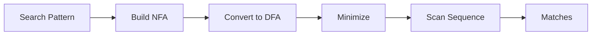

# DNA Pattern Matcher

A bioinformatics tool for finding patterns in DNA sequences using finite automata theory.

---

## Overview

DNA Pattern Matcher is an educational and practical tool that demonstrates how formal language theory (specifically finite automata) applies to biological sequence analysis. It allows researchers and students to:

- **Find exact patterns** (restriction sites, codons, motifs)
- **Use regex patterns** for flexible matching (`ATG[ACGT]*TAA`)
- **Allow mismatches** for approximate matching using Levenshtein automata
- **Visualize the automaton** used for matching

### How It Works



1. Your search pattern is converted to a Non-deterministic Finite Automaton (NFA)
2. The NFA is converted to a Deterministic Finite Automaton (DFA)
3. The DFA is minimized for efficiency
4. The sequence is scanned in linear time O(n)

---

## Features

### Pattern Types

| Type | Description | Example |
|------|-------------|---------|
| **Exact Match** | Find exact occurrences | `ATG`, `GAATTC` |
| **Regex Pattern** | Wildcards and alternation | `ATG[ACGT]*TAA`, `TAA\|TAG\|TGA` |
| **Restriction Sites** | Common enzyme cut sites | EcoRI, BamHI, HindIII |
| **Common Motifs** | Biological motifs | Start codon, TATA box |

### Fuzzy Matching

Allow 0-3 mismatches to find similar sequences. Uses a Levenshtein automaton that extends the DFA to track edit distance.

### Sequence Analysis

- **GC Content**: Percentage of G and C bases
- **Base Composition**: A:T:G:C ratio
- **Complement**: 3' → 5' complement strand
- **Reverse Complement**: 5' → 3' of complement

---

## Quick Start

### Option 1: Open Directly

Open `web/index.html` in your browser. The tool works offline with local pattern matching.

### Option 2: Run with API Server

```bash
cd api
pip install flask flask-cors flask-socketio
python server.py
```

Then open `http://localhost:5000` for full functionality.

---

## Command Line Interface (CLI)

The **`automata_cli`** binary provides a powerful command-line interface for working directly with automata, regular expressions, DNA pattern matching, and pushdown automata. This is useful for scripting, automation, quick testing, and educational purposes.

### Building the CLI

```bash
cd build
cmake ..
make
```

This produces the `build/automata_cli` executable.

### Commands Overview

| Command | Description |
|---------|-------------|
| `regex` | Parse regex, build NFA→DFA→minimized DFA, test strings |
| `dna`   | Find DNA patterns with approximate matching support |
| `pda`   | Test pushdown automata for context-free languages |
| `viz`   | Visualize NFA structure in ASCII art |

---

### `regex` - Regular Expression Demo

Build and test finite automata from regular expressions.

**Usage:**
```bash
automata_cli regex <pattern> [test_string]
```

**Arguments:**
- `<pattern>` – The regular expression pattern (required)
- `[test_string]` – Optional string to test for acceptance

**Example:**
```bash
./build/automata_cli regex "ab*" "abbb"
```

**Output:**
```
=== Regular Expression Demo ===

Pattern: ab*

1. NFA constructed via Thompson's algorithm:
   States: 6
   Transitions: 7

2. DFA constructed via subset construction:
   States: 3
   Transitions: 3

3. Minimized DFA:
   States: 2
   Transitions: 2

4. Regular Grammar:
   S -> aA
   A -> bA
   A -> ε

5. Testing "abbb": ACCEPTED ✓

Execution trace:
   q1 --[a]--> q0
   q0 --[b]--> q0
   q0 --[b]--> q0
   q0 --[b]--> q0 (accepting)

JSON Output:
{"type":"DFA","startState":1,"acceptingStates":[0],...}
```

**Features:**
- Thompson's construction for NFA
- Subset construction for DFA conversion
- Hopcroft's algorithm for DFA minimization
- Generates equivalent regular grammar
- Provides execution trace for test strings
- Outputs JSON representation for programmatic use

---

### `dna` - DNA Sequence Analysis

Find patterns in DNA sequences with optional fuzzy (approximate) matching.

**Usage:**
```bash
automata_cli dna <sequence> <pattern> [max_mismatches]
```

**Arguments:**
- `<sequence>` – The DNA sequence to search (A, C, G, T characters)
- `<pattern>` – The pattern to find
- `[max_mismatches]` – Maximum allowed edit distance (default: 0)

**Example:**
```bash
./build/automata_cli dna "ATGCGATCGATCGATGCGATCG" "ATG" 1
```

**Output:**
```
=== DNA Sequence Analysis Demo ===

Sequence: ATGCGATCGATCGATGCGATCG
Pattern:  ATG
Max mismatches: 1

Sequence length: 22
GC content: 50%
Complement: TACGCTAGCTAGCTACGCTAGC
Rev. complement: CGATCGCATCGATCGATCGCAT

Matches found: 2
  Position 0-3 (forward): "ATG" [distance=0]
  Position 13-16 (forward): "ATG" [distance=0]
```

**Features:**
- Exact and approximate pattern matching using Levenshtein automaton
- Searches both forward and reverse complement strands
- Calculates GC content and sequence statistics
- Reports edit distance for each match

---

### `pda` - Pushdown Automaton Demo

Test pushdown automata for various context-free language recognition tasks.

**Usage:**
```bash
automata_cli pda <type> <input>
```

**Arguments:**
- `<type>` – The PDA type (see table below)
- `<input>` – The input string to test

**PDA Types:**

| Type | Language | Description |
|------|----------|-------------|
| `balanced` | `()^n` | Balanced/nested parentheses |
| `anbn` | `a^n b^n` | Equal a's followed by b's |
| `palindrome` | Palindromes over {a,b} | Palindrome recognizer |
| `rna` | RNA stem-loop | RNA secondary structure |

**Example:**
```bash
./build/automata_cli pda balanced "(())"
```

**Output:**
```
=== Pushdown Automaton Demo ===

Type: balanced
Input: (())

PDA: Balanced Parentheses { ()^n | n >= 0 }
PDA:
  States: ->q0 (q1) 
  Transitions:
    (0, (, ε) -> (0, ()
    (0, ), () -> (0, ε)
    (0, ε, $) -> (1, ε)

Result: ACCEPTED ✓

Execution path:
  [q0, $] => (q0, (, ε) -> (q0, ()
  [q0, ($] => (q0, (, ε) -> (q0, ()
  [q0, (($] => (q0, ), () -> (q0, ε)
  [q0, ($] => (q0, ), () -> (q0, ε)
  [q0, $] => (q0, ε, $) -> (q1, ε)
```

**Features:**
- Multiple pre-built PDA types for common CFLs
- Shows complete execution path with stack operations
- Clear accept/reject result

---

### `viz` - NFA Visualization

Visualize the structure of an NFA in ASCII art directly in the terminal.

**Usage:**
```bash
automata_cli viz <pattern>
```

**Arguments:**
- `<pattern>` – The regular expression pattern to visualize

**Example:**
```bash
./build/automata_cli viz "TAA|TAG|TGA"
```

**Output:**
```
=== NFA Visualization Demo ===
Pattern: TAA|TAG|TGA

NFA Statistics:
  States: 14
  Transitions: 16
  Start State: q0
  Accepting States: q5 q9 q13

╔══════════════════════════════════════════════════════════════════╗
║                    NFA VISUALIZATION                             ║
║  Pattern: TAA|TAG|TGA                                            ║
╠══════════════════════════════════════════════════════════════════╣
║  States: 14                                                      ║
║  Transitions: 16                                                 ║
║  Start: q0                                                       ║
║  Accept: q5, q9, q13                                             ║
╠══════════════════════════════════════════════════════════════════╣
║  TRANSITIONS                                                     ║
╠──────────────────────────────────────────────────────────────────╣
║  → q0: --[ε]-->q1, --[ε]-->q6, --[ε]-->q10                       ║
║    q1: --[T]-->q2                                                ║
║    q2: --[A]-->q3                                                ║
║    q3: --[A]-->q4                                                ║
║    q4: --[ε]-->q5                                                ║
║    q5 (accept): [final state]                                    ║
║    ...                                                           ║
╠══════════════════════════════════════════════════════════════════╣
║  GRAPH (Alternation Pattern)                                    ║
╠──────────────────────────────────────────────────────────────────╣
║         ╭──ε──○──T──○──A──○──A──◎                     "TAA"      ║
║         ├──ε──○──T──○──A──○──G──◎                     "TAG"      ║
║         ╰──ε──○──T──○──G──○──A──◎                     "TGA"      ║
║         │                                                        ║
║    →○───┘  (q0 = start)                                          ║
╠══════════════════════════════════════════════════════════════════╣
║  LEGEND                                                          ║
║  → = Start state    ○ = State    ◎ = Accept state               ║
║  ε = Epsilon (empty) transition                                  ║
╚══════════════════════════════════════════════════════════════════╝

Transition Table:
--------------------------------------------------
From      Symbol         To        
--------------------------------------------------
q0        ε (epsilon)   q1        
q0        ε (epsilon)   q6        
...
--------------------------------------------------

Test Strings:
  "TAA" => ✓ ACCEPTED
  "TAG" => ✓ ACCEPTED
  "TGA" => ✓ ACCEPTED
  "INVALID" => ✗ REJECTED
```

**Features:**
- ASCII art NFA structure visualization
- Grouped transitions by state
- Special rendering for alternation patterns
- Automatic test case generation based on pattern
- Complete transition table

---

### CLI Examples Summary

```bash
# Test a regex pattern with a string
./build/automata_cli regex "a(b|c)*d" "abcbd"

# Find ATG codons allowing 1 mismatch
./build/automata_cli dna "ATGCGATCGATCG" "ATG" 1

# Check balanced parentheses
./build/automata_cli pda balanced "((()))"

# Visualize stop codon NFA
./build/automata_cli viz "TAA|TAG|TGA"
```

---

## File Structure

```
Automata/
├── build/
│   └── automata_cli         # Command-line interface binary
├── web/
│   ├── index.html           # Main application
│   ├── css/styles.css       # DNA-themed styling
│   └── js/dna-matcher.js    # Pattern matching logic
├── api/
│   ├── server.py            # Flask REST API
│   └── automata_engine.py   # Python automata implementation
├── include/                 # C++ headers
│   ├── automata/            # Automata core (NFA, DFA, PDA, Regex)
│   └── bio/                 # Bioinformatics utilities
├── src/
│   └── main.cpp             # CLI entry point
└── docs/
    └── DOCUMENTATION.md     # This file
```

---

## Technical Background

### Finite Automata for Pattern Matching

A **Deterministic Finite Automaton (DFA)** is a state machine that:
- Has a finite set of states
- Starts in an initial state
- Reads input one symbol at a time
- Transitions to a new state based on the current state and input
- Accepts if it ends in an accepting state

For DNA pattern matching, we build a DFA where:
- States represent "how much of the pattern we've matched so far"
- Transitions are labeled with DNA bases (A, C, G, T)
- The accepting state means "pattern found"

### Levenshtein Automaton

For approximate matching, we extend the DFA to track edit distance:

```
State = (pattern_position, edits_so_far)

Transitions:
- Match: (i, k) → (i+1, k)      [same base, no new edit]
- Mismatch: (i, k) → (i+1, k+1) [different base, +1 edit]
- Insertion: (i, k) → (i, k+1)  [extra base in text]
- Deletion: (i, k) → (i+1, k+1) [missing base in text]
```

---

## Examples

### Finding Start Codons

**Sequence**: `ATGCGATCGATCGATGCTAGCTAG`  
**Pattern**: `ATG`  
**Matches**: Positions 1, 13

### Finding Genes (Start to Stop)

**Sequence**: `ATGCGATCGATAACGATCGTAGGATCGTGACGATCG`  
**Pattern**: `ATG[ACGT]*?(TAA|TAG|TGA)`  
**Matches**: Open reading frames

### Restriction Site Analysis

**Sequence**: `ATCGATCGAATTCGATCGATCGAATTCGATCG`  
**Pattern**: `GAATTC` (EcoRI)  
**Matches**: Positions 9, 22

---

## API Reference

### POST /api/bio/match

Find patterns in a DNA sequence.

**Request:**
```json
{
  "sequence": "ATGCGATCGATCG",
  "pattern": "ATG",
  "maxDistance": 1,
  "searchBothStrands": true
}
```

**Response:**
```json
{
  "success": true,
  "matches": [
    {"start": 0, "end": 3, "text": "ATG", "distance": 0, "strand": "forward"}
  ],
  "dfaStates": 4,
  "matchType": "DFA"
}
```

---

## References

1. Hopcroft, J.E. et al. *Introduction to Automata Theory, Languages, and Computation*
2. Navarro, G. *A Guided Tour to Approximate String Matching*
3. Durbin, R. et al. *Biological Sequence Analysis*
