```mermaid
stateDiagram-v2
    direction LR
    [*] --> q0
    
    q0 --> q0 : "a, ε → A"
    q0 --> q1 : "b, A → ε"
    q1 --> q1 : "b, A → ε"
    
    q1 --> [*] : "ε, Z → Z"
    
    note left of q0 : Push phase
    note right of q1 : Pop phase
```

```mermaid
stateDiagram-v2
    direction LR
    [*] --> q0
    
    q0 --> q0 : "a, ε → a"
    q0 --> q0 : "b, ε → b"
    q0 --> q1 : "ε, ε → ε (guess middle)"
    
    q1 --> q1 : "a, a → ε"
    q1 --> q1 : "b, b → ε"
    
    q1 --> [*] : "ε, Z → Z"
    
    note left of q0 : First half (push)
    note right of q1 : Second half (pop & match)
```

# Automata Simulator - Test Cases & Visualization

> **Generated:** December 20, 2025  
> **Purpose:** Comprehensive test cases with Mermaid diagrams for the Automata Simulator

---

## 📋 Table of Contents

1. [Regular Expression Tests](#1-regular-expression-tests)
2. [NFA Visualization Tests](#2-nfa-visualization-tests)
3. [DNA Pattern Matching Tests](#3-dna-pattern-matching-tests)
4. [Pushdown Automaton (PDA) Tests](#4-pushdown-automaton-pda-tests)
5. [KMP Failure Function Tests](#5-kmp-failure-function-tests)

---

## 1. Regular Expression Tests

### Test Case 1.1: Simple Alternation with Kleene Star

**Pattern:** `a(b|c)*d`  
**Test String:** `abcbd`  
**Expected Result:** ✅ ACCEPTED

#### Input/Output

```
Pattern: a(b|c)*d
Test:    abcbd

NFA States:     12
NFA Transitions: 14
DFA States:     5
DFA Transitions: 10
Minimized DFA:  3 states, 4 transitions
```

#### Regular Grammar

```
S → aB
B → bB | cB | dA
A → ε
```

#### Execution Trace

| Step | State | Symbol | Next State |
|------|-------|--------|------------|
| 1    | q1    | a      | q2         |
| 2    | q2    | b      | q2         |
| 3    | q2    | c      | q2         |
| 4    | q2    | b      | q2         |
| 5    | q2    | d      | q0 ✓       |

#### Minimized DFA Diagram


---

### Test Case 1.2: Simple DNA Pattern

**Pattern:** `ATG`  
**Test String:** `ATGATGATG`  
**Expected Result:** ❌ REJECTED (exact match only, not substring)

#### Input/Output

```
Pattern: ATG

NFA States:     6
NFA Transitions: 5
DFA States:     4
DFA Transitions: 3
Minimized DFA:  4 states, 3 transitions
```

#### Regular Grammar

```
S → AB
B → TC
C → GA
A → ε
```

#### DFA Diagram


---

### Test Case 1.3: Complex Regex Pattern

**Pattern:** `(AT|CG)*A?(GG+|T{2,3})(C|GA)?A+T`  
**Test String:** `TTAAT`  
**Expected Result:** ✅ ACCEPTED

#### Input/Output

```
Pattern: (AT|CG)*A?(GG+|T{2,3})(C|GA)?A+T

NFA States:     54
NFA Transitions: 65
DFA States:     21
DFA Transitions: 49
Minimized DFA:  14 states, 31 transitions
```

#### Execution Trace

| Step | State | Symbol | Next State |
|------|-------|--------|------------|
| 1    | q2    | T      | q13        |
| 2    | q13   | T      | q3         |
| 3    | q3    | A      | q7         |
| 4    | q7    | A      | q7         |
| 5    | q7    | T      | q0 ✓       |

#### DFA State Diagram


---

## 2. NFA Visualization Tests

### Test Case 2.1: DNA Stop Codons (Alternation)

**Pattern:** `TAA|TAG|TGA`

#### Input/Output

```
Pattern: TAA|TAG|TGA

NFA States:     22
NFA Transitions: 23
Start State:    q0
Accepting:      q21
```

#### Test Results

| Input     | Expected | Result |
|-----------|----------|--------|
| `TAA`     | Accept   | ✅ ACCEPTED |
| `TAG`     | Accept   | ✅ ACCEPTED |
| `TGA`     | Accept   | ✅ ACCEPTED |
| `INVALID` | Reject   | ❌ REJECTED |
| `(empty)` | Reject   | ❌ REJECTED |

#### NFA Structure Diagram


#### Simplified Alternation View

```mermaid
graph LR
    subgraph "Stop Codon NFA"
        Start((q0)) --> |ε| Branch1[TAA Branch]
        Start --> |ε| Branch2[TAG Branch]
        Start --> |ε| Branch3[TGA Branch]
        
        Branch1 --> |T→A→A| Accept((Accept))
        Branch2 --> |T→A→G| Accept
        Branch3 --> |T→G→A| Accept
    end
    
    style Start fill:#90EE90,stroke:#228B22
    style Accept fill:#87CEEB,stroke:#4169E1
```



---

### Test Case 2.2: Kleene Star Pattern

**Pattern:** `AT*G`

#### NFA Diagram


#### Test Cases

| Input   | Expected | Description              |
|---------|----------|--------------------------|
| `AG`    | Accept   | Zero Ts                  |
| `ATG`   | Accept   | One T                    |
| `ATTG`  | Accept   | Two Ts                   |
| `ATTTG` | Accept   | Three Ts                 |
| `AT`    | Reject   | Missing G                |
| `TG`    | Reject   | Missing A                |

---

## 3. DNA Pattern Matching Tests

### Test Case 3.1: Exact Pattern Matching

**Sequence:** `ATGCGATCGATCGATGCTAGCTAGATGCGATCGTAGCTAATGCGATCG`  
**Pattern:** `ATG`  
**Max Mismatches:** 0

#### Input/Output

```
Sequence length: 48
GC content:      50%
Complement:      TACGCTAGCTAGCTACGATCGATCTACGCTAGCATCGATTACGCTAGC
Rev. complement: CGATCGCATTAGCTACGATCGCATCTAGCTAGCATCGATCGATCGCAT
```

#### Match Results

| Match # | Position | Text  | Direction | Edit Distance |
|---------|----------|-------|-----------|---------------|
| 1       | 0-3      | `ATG` | Forward   | 0             |
| 2       | 13-16    | `ATG` | Forward   | 0             |
| 3       | 24-27    | `ATG` | Forward   | 0             |
| 4       | 39-42    | `ATG` | Forward   | 0             |

#### Sequence Visualization


#### KMP Automaton for Pattern "ATG"


---

## 4. Pushdown Automaton (PDA) Tests

### Test Case 4.1: Balanced Parentheses

**Type:** `balanced`  
**Input:** `((()))`  
**Expected Result:** ✅ ACCEPTED

#### PDA Configuration

```
Language: { ()^n | n >= 0 }
States: q0
Transitions:
  (0, (, ε) → (0, ()
  (0, ), () → (0, ε)
```

#### Execution Path

| Step | State | Remaining | Stack | Transition |
|------|-------|-----------|-------|------------|
| 1    | 0     | ((()))    | Z     | push (     |
| 2    | 0     | (()))     | Z(    | push (     |
| 3    | 0     | ()))      | Z((   | push (     |
| 4    | 0     | )))       | Z(((  | pop (      |
| 5    | 0     | ))        | Z((   | pop (      |
| 6    | 0     | )         | Z(    | pop (      |
| 7    | 0     | ε         | Z     | accept     |

#### PDA State Diagram

```mermaid
stateDiagram-v2
    direction LR
    [*] --> q0
    
    q0 --> q0 : "(, ε → ("
    q0 --> q0 : "), ( → ε"
    
    q0 --> [*] : "ε, Z → Z (accept)"
    
    note right of q0 : Single State PDA
```



#### Stack Visualization


---

### Test Case 4.2: a^n b^n Language

**Type:** `anbn`  
**Test Cases:**

| Input      | Expected | Description     |
|------------|----------|-----------------|
| `ab`       | Accept   | n=1             |
| `aabb`     | Accept   | n=2             |
| `aaabbb`   | Accept   | n=3             |
| `aab`      | Reject   | Unbalanced      |
| `abb`      | Reject   | Unbalanced      |
| `ba`       | Reject   | Wrong order     |

#### PDA Diagram



---

### Test Case 4.3: Palindrome Recognizer

**Type:** `palindrome`  
**Alphabet:** {a, b}

| Input      | Expected | Description        |
|------------|----------|--------------------|
| `aba`      | Accept   | Odd palindrome     |
| `abba`     | Accept   | Even palindrome    |
| `aabaa`    | Accept   | Odd palindrome     |
| `ab`       | Reject   | Not a palindrome   |
| `abc`      | Reject   | Invalid character  |

#### PDA Diagram



---

## 5. KMP Failure Function Tests

### Test Case 5.1: Pattern "ATG"

**Failure Function:** `[0, 0, 0]`

```
Pattern:  A  T  G
Index:    0  1  2
Failure:  0  0  0

All failures go to q0
```


---

### Test Case 5.2: Pattern "AAAA"

**Failure Function:** `[0, 1, 2, 3]`

```
Pattern:  A  A  A  A
Index:    0  1  2  3
Failure:  0  1  2  3

Failures go to progressively earlier states
```


---

### Test Case 5.3: Pattern "ABAB"

**Failure Function:** `[0, 0, 1, 2]`

```
Pattern:  A  B  A  B
Index:    0  1  2  3
Failure:  0  0  1  2

Failure from q3 goes to q1
```


---

### Test Case 5.4: Pattern "ATAT"

**Failure Function:** `[0, 0, 1, 2]`

```
Pattern:  A  T  A  T
Index:    0  1  2  3
Failure:  0  0  1  2

Failure from q3 goes to q1
```


---

## 📊 Summary Statistics

| Category        | Test Cases | Passed | Coverage |
|-----------------|------------|--------|----------|
| Regex/NFA       | 5          | 5      | 100%     |
| DNA Matching    | 4          | 4      | 100%     |
| PDA Tests       | 3          | 3      | 100%     |
| KMP Tests       | 4          | 4      | 100%     |
| **Total**       | **16**     | **16** | **100%** |

---

## 🔗 Related Documentation

- [DOCUMENTATION.md](./DOCUMENTATION.md) - Full API and usage documentation
- [README.md](../README.md) - Project overview and quick start

---

*Generated by Automata Simulator CLI v1.0*
